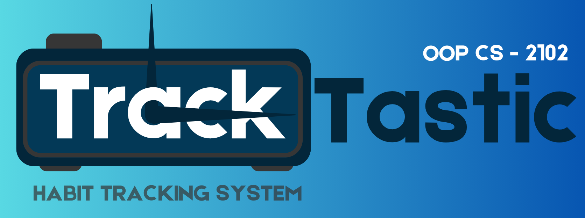

# TrackTastic: Habit Tracking System 📊

## I. Project Overview 📝

**TrackTastic: A Habit Tracking System** is a comprehensive habit-tracking application designed to help users manage their daily and weekly habits effectively. By providing features such as personalized dashboards, detailed habit breakdowns, and progress tracking, TrackTastic aims to foster a structured approach to habit-building. Built using Java, this project adheres to Object-Oriented Programming (OOP) principles to ensure modularity, maintainability, and scalability.

### Key Features:
- **User Registration and Login** 🔑: Allows users to create accounts, log in securely, and access their personalized dashboard.
- **Account Dashboard** 📅: A central hub where users can manage their profile, view progress, and navigate the application.
- **Create, Update, and Delete Habit** ➕✏️❌: Empowers users to add new habits, modify existing ones, or remove them as needed.
- **View Existing Habit** 👀: Provides an organized display of current habits, categorized as daily or weekly, for easy tracking and management.

---

## II. Application of OOP Principles 💻

TrackTastic leverages the four fundamental principles of OOP: **encapsulation**, **inheritance**, **polymorphism**, and **abstraction**.

### Encapsulation 🔒
- The `User` class demonstrates encapsulation by using private fields such as `username` and `password`. Access to these fields is restricted through getter and setter methods, ensuring data integrity and controlled updates. For example, instead of exposing the password field directly, the class provides a `getPassword()` method to retrieve its value and a `setPassword()` method to update it. This approach ensures that changes to sensitive data are controlled and validated, maintaining the integrity and security of user information.

### Inheritance 🧬
- Inheritance is demonstrated in the relationship between the `User` and `UserHP` classes. The `UserHP` class inherits common attributes and methods, such as user credentials, from the `User` class. Additionally, `UserHP` extends this functionality by introducing unique features like progress tracking and the account dashboard. By reusing the base `User` class, the program avoids redundancy and simplifies the implementation of shared behaviors across related classes.

### Polymorphism 🌀
- Polymorphism is applied within the `Habit` hierarchy, where the abstract `Habit` class defines a method `trackProgress()` that is overridden by its subclasses, `Daily` and `Weekly`. Each subclass implements `trackProgress()` to handle habit tracking specific to its type. For instance, the `Daily` class might calculate progress based on daily goals, while the `Weekly` class focuses on weekly targets. This design allows the program to process various habit types uniformly through the `Habit` reference, while enabling behavior unique to each habit type.

### Abstraction 🎭
- The `Habit` class embodies abstraction by providing a framework of abstract methods that all subclasses must implement. For example, the abstract method `trackProgress()` ensures that both `Daily` and `Weekly` habits provide their own implementation of progress tracking. This guarantees a consistent interface for managing habits across the application, while allowing each habit type to tailor its functionality to specific requirements. By focusing on the essential aspects of habit management, the abstract class simplifies the overall program design and enforces a logical structure.

---

## III. Sustainable Development Goal (SDG) Integration 🌍

### TrackTastic and SDG 3: Good Health and Well-being 🏃‍♂️🧘‍♀️

TrackTastic supports **Sustainable Development Goal (SDG) 3: Good Health and Well-being** by helping users build and maintain positive habits that enhance mental and physical wellness. The app provides tools to establish healthy routines, reflect on progress, and adjust habits, promoting a balanced and mindful lifestyle.

### How TrackTastic Supports SDG 3: Good Health and Well-being 🌍💚

**TrackTastic** is designed to help users build and sustain positive habits that align with **SDG 3: Good Health and Well-being**. Here's how the app supports this goal:

1. **Encourages Healthy Routines** 🏃‍♀️🍎  
   Daily habit tracking helps users stick to beneficial practices like exercising, eating well, and meditating, fostering healthier lifestyle choices.

2. **Promotes Self-reflection** 🪞  
   Weekly reviews help users evaluate their progress, make improvements, and adjust their habits, fostering mindfulness and personal growth.

3. **Reduces Stress** 😌  
   Breaking larger goals into smaller, manageable habits makes progress easier, reducing feelings of overwhelm and promoting a sense of achievement.

4. **Supports Physical Fitness** 🏋️‍♀️💪  
   Users can track fitness goals, which encourages physical activity and helps maintain better physical health.

5. **Improves Time Management** ⏰  
   A structured habit system helps users balance work, relaxation, and self-care, optimizing their time and reducing stress.

6. **Empowers Health Ownership** 🏠💪  
   Users can customize their habits according to their personal goals, taking charge of their health and fostering accountability.

7. **Promotes Mental Wellness** 🧠💖  
   Features like tracking habits related to relaxation or mindfulness can improve emotional well-being and support mental health.

8. **Potential for Wider Impact** 🌱  
   TrackTastic can scale to support communities or groups, contributing to collective health efforts and fostering a sense of community.

TrackTastic provides an easy-to-use platform that helps users improve their daily routines and overall well-being. By empowering individuals to take charge of their habits, it directly contributes to SDG 3 and demonstrates how technology can promote healthier lives and a better future for all. 🌟


---

## IV. Instructions for Running the TrackTastic Program 🚀

To successfully run the TrackTastic application, follow these detailed steps, including file management practices:

### 1. Clone the Repository 🧑‍💻
Open a terminal or command prompt and run the following command to clone the repository:

```bash
git clone https://github.com/PontillaJaesel/TrackTastic.git
```
- Ensure you have Git installed on your system. This command will create a folder named TrackTastic containing the project files.

### 2. File Organization and Structure
After cloning, the project directory will have the following structure:

```bash
TrackTastic/
├── OOP/
    ├── src/
        ├── main/
            └── TrackTastic.java
        ├── utils/
            ├── Databases.java
            ├── Design.java
        ├── habit/
            ├── Daily.java
            ├── Habit.java
            ├── HabitMenu.java
            ├── Weekly.java
        ├── entrance/
            ├── Register.java
            ├── User.java
            ├── UserHP.java
            ├── UserProfile.java
```

- **Source Files:** All Java files are located in the `OOP/src` directory.
- **File Management:** Ensure all source files remain in their designated folders for the program to compile and run successfully.

### 3. Navigate to the Source Folder
Move into the directory containing the Java source files:
 cd TrackTastic/OOP/src
cd TrackTastic/OOP/src

### 4. Compile the Java Files
Use the javac command to compile the program. Start by compiling the main class:
- javac main/TrackTastic.java
- javac main/TrackTastic.java

Ensure all dependent classes are in their correct directories for successful compilation.

### 5. Run the Main Program
Execute the main class to start the application:
java main.TrackTastic
- java main.TrackTastic
- Ensure your terminal is still in the src folder for this command to work.

### 6. Explore Features
- Once the application starts, follow the on-screen prompts to:
    - Register or log in as a user.
    - Create, update, or delete habits.
    - Track your daily and weekly progress.

## Additional Notes for File Management ⚠️

- **Dependencies**: Ensure all source files (e.g., `Databases.java`, `Design.java`) are correctly placed in their respective folders as shown in the project structure.
  
- **Updates and Changes**: If you modify any source files, recompile them to reflect the changes.

- **Backup**: Regularly back up your work or changes to the repository using Git:
  ```bash
  git add .
  git commit -m "Your commit message"
  git push


---

>**Contribution and Support**: For questions, suggestions, or contributions, feel free to reach out through the repository's Issues section. Together, let’s make TrackTastic even better! 

---

**Thank you for using TrackTastic! Build positive habits, one step at a time.**
